<!-- markdownlint-disable MD013 MD033 MD041 -->

  

<h1 align="center">Sajad Khanmirzaei</h1>

  Full-Stack Developer&nbsp; ·&nbsp; DevOps Engineer&nbsp; ·&nbsp; Applied AI&nbsp; ·&nbsp; Founder &amp; CEO of <a href="https://hiprax.com">Hiprax</a>

  
  
  
  

  

## ~/about

I build web applications end to end, and then I keep them alive.

That second half is where it gets interesting. Shipping a demo is easy. Surviving real traffic, a bored attacker, and a bad deploy on a Friday afternoon is a different job, and it's the one I actually like. I founded **[Hiprax](https://hiprax.com)** to do that work with two engineers I've known for years.

Most of my time now goes to the seam between production engineering and applied AI: retrieval pipelines, agents that take real actions, voice interfaces, and the deeply unglamorous plumbing that keeps them predictable on the days a model decides to get creative.

Ten years and sixty-odd projects in, every client has come back for more. That's the metric I care about.

## ~/how-i-ship

  

Every project I take on gets deployed the same shape. One compose file, one root `.env`, one port on the loopback interface, and an Nginx on the host holding the only certificate. There is exactly one door into the stack, and everything else talks over the compose network where the internet can't reach it.

Here's the detail that decides it. Publish a container port without binding it to `127.0.0.1` and Docker DNATs it in the `nat` table before your firewall ever gets a say. The packet is routed through `FORWARD`, where Docker's own rules accept it, and never reaches the `INPUT` chain where your `ufw` rules live. So the port you believe is closed is open to the whole internet, and `ufw status` will happily tell you it's blocked. Plenty of "firewalled" stacks are wide open for exactly this reason.

None of this is clever, and that's the point. I can rebuild it on a bare VPS in an afternoon, and so can whoever inherits it from me.

## ~/work

Products I've built with Hiprax. Most are under NDA, so these are the shapes rather than the client names.

| Project | What it does | Stack |
| :-- | :-- | :-- |
| **AI Print-on-Demand Studio** | Generate original artwork from a prompt, refine it in a full in-browser design editor, then order it on real products. | MERN · Fabric.js · Socket.io · GenAI |
| **AI Political Transparency** | Aggregates political news and fact-checks live speech in real time, with a conversational AI for civic questions. | MERN · WebSocket / SSE · AI |
| **Omnichannel AI Sales** | A subscription CRM where businesses train custom AI agents that run SMS and voice outreach and close deals on their own. | MERN · Stripe · AI |
| **Conversational AI Ordering** | Human-like voice AI that answers restaurant calls and takes orders through natural conversation. | Python · TensorFlow · Transformers · FastAPI |
| **Financial Fraud Prevention** | Real-time verification so people can tell a genuine bank contact from an impersonation scam. | Node · React · REST |
| **Stereoscopic 3D Streaming** | Dual-camera live pipeline with intelligent object alignment for real-time stereoscopic display. | Computer Vision · Streaming |

<b>The full list — the 23 I can name</b>

AI Company Showcase & Marketing Website · AI Market Intelligence Suite · AI Print-on-Demand Design Studio · AI-Powered Investment Signal Platform · AI-Powered Political Transparency Platform · Advanced HTTP Parameter Pollution Shield · Conversational AI Ordering System · Dynamic Audio Visualization Engine · Enterprise Admin Dashboard UI Kit · Enterprise-Grade Encryption Library · Financial Fraud Prevention Platform · Full-Stack Image Processing & Delivery System · Full-Stack Ticketing & Support Management System · Government Document Automation Suite · Omnichannel AI Sales Engagement Platform · Peer-to-Peer Storage Marketplace · Production-Grade Structured Logging Toolkit for Node.js · React SEO Management Hook · Real Estate Auction Intelligence System · Real-Time Penny Auction Platform · Social Engagement Rewards Platform · Stereoscopic 3D Streaming System · Vending Machine Operations Platform

Five of them are open source; you can read every line in the next section. The rest live at **[hiprax.com](https://hiprax.com/#projects)**.

## ~/open-source

Seven packages on **[npm](https://www.npmjs.com/~hiprax)** — four under the `@hiprax` scope, three unscoped — all MIT. Around 11,600 downloads in the last year: modest, real, and not a vanity number. `@hiprax/crypto` and `@hiprax/logger` publish from CI through npm's OIDC trusted publishing, so no token ever touches a laptop.

| Package | What it gives you |
| :-- | :-- |
| **[`@hiprax/crypto`](https://www.npmjs.com/package/@hiprax/crypto)**      | AES-256-GCM authenticated encryption with Argon2id key derivation, file streaming, and constant-time comparison. Zero runtime dependencies. |
| **[`hppx`](https://www.npmjs.com/package/hppx)**      | HTTP Parameter Pollution shield for Express: blocks prototype pollution, null-byte injection, and DoS vectors with nested whitelists. |
| **[`pixel-serve-server`](https://www.npmjs.com/package/pixel-serve-server)**      | Sharp-powered image middleware: on-the-fly AVIF and WebP conversion, resizing, strict path validation, smart caching. |
| **[`pixel-serve-client`](https://www.npmjs.com/package/pixel-serve-client)**      | The React half of Pixel Serve: multi-format srcset, lazy loading, a skeleton loader, SSR-safe fallbacks. |
| **[`@hiprax/use-seo`](https://www.npmjs.com/package/@hiprax/use-seo)**      | One React hook for titles, Open Graph, Twitter Cards, hreflang, and JSON-LD. SSR-safe and fully tested. |
| **[`@hiprax/logger`](https://www.npmjs.com/package/@hiprax/logger)**      | Winston-based structured logging with daily rotation, verified IANA timezones, and an Express middleware that masks secrets automatically. |
| **[`@hiprax/errors`](https://www.npmjs.com/package/@hiprax/errors)**      | Modular error handling for Express: structured, typed error classes and consistent API responses. |

## ~/stack

| Layer | Tools |
| :-- | :-- |
| **Frontend** | React · TypeScript · Next.js · Tailwind · Three.js |
| **Backend** | Node · Express · Python · FastAPI · Django |
| **Data** | MongoDB · Redis · PostgreSQL · MySQL · Elasticsearch |
| **Infra** | Linux · Docker · Kubernetes · Nginx · AWS · Cloudflare · GitHub Actions |
| **Applied AI** | RAG · agents · OpenAI · LangChain · Hugging Face · PyTorch · Whisper / voice |
| **Security** | OWASP · OAuth / JWT · AES-GCM · Argon2id · TLS · pentesting |

Vue, Svelte, Angular, Flask, PHP, and Laravel are in the toolbox too, when a project already lives there.

## ~/principles

> **No shortcuts. No hand-holding frameworks. No blind dependency on AI.**  
> Just engineers who understand what they build, top to bottom.
>
> I'd rather ship something I can debug at 3am than something I can only demo.

## ~/connect

Open to full-time roles, contracts, and the occasional interesting collaboration. I work remotely with teams anywhere.

The fastest way to reach me is email. Tell me what you're building, what it runs on, and what's currently on fire.

  
  

  
    
  
    Three hand-written SVGs and a few live npm badges. No stats card, no streak counter, no snake. 
    Every animation is CSS and respects <code>prefers-reduced-motion</code>. 
    The stats card is missing on purpose: almost everything I build is under NDA in private repos, so it would only ever measure the sliver that isn't.
  

