<!-- markdownlint-disable MD013 MD033 MD041 -->

  

<h1 align="center">Sajad Khanmirzaei</h1>

  Full-Stack Developer&nbsp; ·&nbsp; DevOps Engineer&nbsp; ·&nbsp; Applied AI&nbsp; ·&nbsp; Founder &amp; CEO of <a href="https://hiprax.com">Hiprax</a>

  
  
  
  
  

  

## ~/about

I'm Sajad, a full-stack developer and DevOps engineer based in Spain. I'm the founder and CEO of **[Hiprax](https://hiprax.com)**, a small senior team that ships scalable, secure, and fast web applications end to end, from the database and infrastructure up to the last pixel.

My work sits where production web engineering meets applied AI. I build MERN-stack platforms, design the cloud and CI/CD they run on, harden them against real-world abuse, and increasingly wire them up to language models: retrieval-augmented generation, autonomous agents, voice interfaces, and the unglamorous plumbing that makes any of it reliable in production.

Over a decade and 60+ shipped projects later, I've delivered for startups and enterprises alike, and every client has come back for more. That is the only metric I really trust.

## ~/focus

What I actually do, and where I add the most value:

| Area | What it means in practice |
| :-- | :-- |
| **Full-stack web apps** | End-to-end product engineering on the MERN stack and modern React / Next.js, from schema to UI. |
| **DevOps &amp; cloud** | The infrastructure it all runs on: Docker, Kubernetes, Nginx, CI/CD, and hardened Linux servers. |
| **Applied AI** | RAG pipelines, LLM-powered agents, voice interfaces, and the production plumbing that keeps them reliable. |
| **Security** | Auth, encryption, API hardening, and audits, treated as a first-class requirement rather than an afterthought. |

## ~/stack

My core toolkit, by layer:

| Layer | Tools |
| :-- | :-- |
| **Frontend** |  |
| **Backend** |  |
| **Data** |  |
| **DevOps &amp; Cloud** |  |

Also in the toolbox when a project calls for it: Vue, Svelte, Angular, Flask, PHP, and Laravel.

And the specialisms that logos don't quite capture, where most of my recent work lives:

  
  
  
  
  
  
  
  

  
  
  
  
  
  

## ~/work

A few of the products I've built with Hiprax:

| Project | What it does | Stack |
| :-- | :-- | :-- |
| **AI Print-on-Demand Studio** | Generate original artwork from prompts, refine it in a full in-browser design editor, then order it on real products. | MERN · Fabric.js · Socket.io · GenAI |
| **AI Political Transparency** | Aggregates political news and fact-checks live speech in real time, with a conversational AI for civic questions. | MERN · WebSocket / SSE · AI |
| **Omnichannel AI Sales** | Businesses train custom AI agents that run SMS and voice outreach and close deals on their own. | MERN · Stripe · AI |
| **Conversational AI Ordering** | Human-like voice AI that answers restaurant calls and takes orders through natural conversation. | Python · TensorFlow · Transformers · FastAPI |
| **Financial Fraud Prevention** | Real-time verification so people can tell a genuine bank contact from an impersonation scam. | Node · React · REST |
| **Vending Ops Platform** | End-to-end fleet operations: inventory, dispatch, logistics, and billing on a subscription model. | MERN · Stripe |

A dozen more, from real-estate auction intelligence and government e-signature automation in Spain to stereoscopic 3D computer-vision pipelines, live at **[hiprax.com](https://hiprax.com)**.

## ~/open-source

I build and maintain free, public npm packages, several under the **[`@hiprax`](https://www.npmjs.com/~hiprax)** scope, used by developers worldwide.

| Package | What it gives you |
| :-- | :-- |
| **[`@hiprax/crypto`](https://www.npmjs.com/package/@hiprax/crypto)**     | AES-256-GCM authenticated encryption with Argon2id key derivation, file streaming, constant-time comparisons, and strict TypeScript types. |
| **[`hppx`](https://www.npmjs.com/package/hppx)**     | Next-gen HTTP Parameter Pollution shield for Express: blocks prototype pollution, null-byte injection, and DoS vectors with nested whitelists. |
| **[`pixel-serve-server`](https://www.npmjs.com/package/pixel-serve-server)**     | Sharp-powered image optimization middleware: on-the-fly AVIF and WebP conversion, resizing, strict path validation, and smart caching. |
| **[`pixel-serve-client`](https://www.npmjs.com/package/pixel-serve-client)**     | The React half of Pixel Serve: multi-format srcset, lazy loading, a built-in skeleton loader, and SSR-safe fallbacks. |
| **[`@hiprax/use-seo`](https://www.npmjs.com/package/@hiprax/use-seo)**     | One React hook for titles, Open Graph, Twitter Cards, hreflang, and JSON-LD structured data. SSR-safe and fully tested. |
| **[`@hiprax/logger`](https://www.npmjs.com/package/@hiprax/logger)**     | Winston-based structured logging with daily rotation, verified IANA timezones, and an Express middleware that masks secrets automatically. |
| **[`@hiprax/errors`](https://www.npmjs.com/package/@hiprax/errors)**     | Modular error handling for Express.js: structured, typed error classes and consistent API error responses. |

## ~/principles

> **No shortcuts. No hand-holding frameworks. No blind dependency on AI.**  
> Just engineers who understand what they build, top to bottom.
>
> I'd rather ship something I can debug at 3am than something I can only demo.

## ~/connect

I'm open to full-time roles, contracts, and interesting collaborations, remote or here in Spain. The fastest way to reach me is LinkedIn or email.

<!--
  Résumé: drop a hosted CV link here and I'll wire it into the top bar too, for example:
  
-->

  
  

  
    
  Designed and built by me. Every animation respects <code>prefers-reduced-motion</code>.

